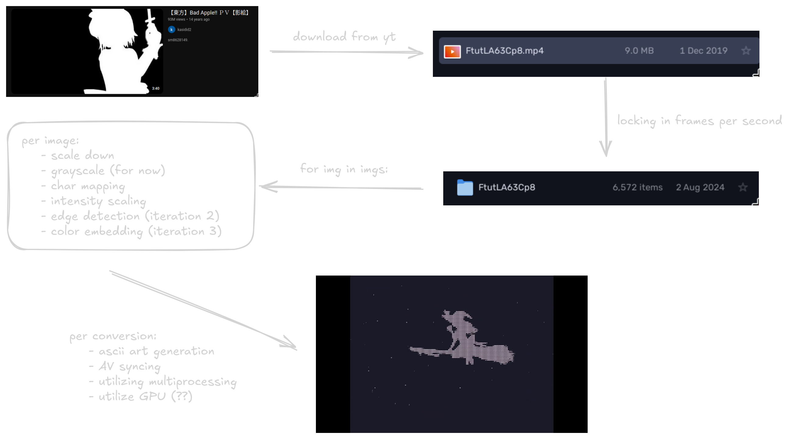

# Literature Survey: Video-to-ASCII Art Player

## Course: 20XW97 - Computer Vision and Image Analysis Lab

## Test: CA1 Lab Component

### Workflow

This project aims to convert video frames into ASCII art and render them as an animated sequence. Though it doesn't solve a direct real-world problem, it provides insight into various image processing techniques using OpenCV and Python. The following outlines the steps and processes involved in building the project:

#### 1. **Frame Extraction and Preprocessing**
   - **Video Frame Extraction**: The video is split into individual frames using OpenCV's `VideoCapture`. The frames are stored as images for further processing. 
   - **Image Resizing**: Each frame is resized to reduce complexity while preserving essential visual elements. This is done using a scaling factor that adjusts the resolution for ASCII conversion.
   - **Grayscale Conversion**: The frames are converted to grayscale, simplifying the pixel values for mapping to ASCII characters.
   - **Edge Detection (Planned)**: In future iterations, edge detection (using algorithms like Canny or Sobel) will be incorporated to retain more visual details, enhancing the quality of the ASCII art.

#### 2. **ASCII Mapping and Character Representation**
   - **Character Mapping**: A set of ASCII characters is defined, with each representing a different intensity level of brightness. For example, lighter pixels map to characters like "." or " ", while darker pixels map to denser characters like "@" or "#".
   - **Intensity Scaling**: The grayscale pixel values (ranging from 0 to 255) are normalized and scaled to match the number of characters in the ASCII set.
   - **ASCII Art Generation**: The image's pixel values are transformed into ASCII characters, line by line, to form the ASCII version of each video frame. This conversion involves looping over each pixel and assigning the corresponding ASCII character based on brightness.

#### 3. **Rendering and Synchronization**
   - **Parallel Processing**: Since converting video frames to ASCII can be computationally intensive, Python’s `multiprocessing` library is used to parallelize the conversion. This ensures efficiency and faster frame processing.
   - **Audio-Video Sync**: While the ASCII frames are generated, the original video's audio is played using FFplay. The ASCII art is displayed in sync with the audio by controlling the frame rate and ensuring that the visual and auditory components match.
   - **Frame Display**: Each ASCII frame is displayed on the terminal, creating the effect of a continuous ASCII animation. The frame rate is adjusted to ensure smooth playback, mimicking the original video's timing.

#### 4. **Future Enhancements**
   - **Color Addition**: In future iterations, color information from the original frames will be included in the ASCII representation, further enhancing the visual appeal and allowing for more detailed renditions.
   - **Edge Detection Improvements**: To retain more intricate details, edge detection techniques will be refined, ensuring the ASCII art retains critical visual elements of the original video.
   - **Additional Features**: Optimizations for different terminal sizes and font scaling may be considered to improve viewing experiences across various platforms.

### Inspiration/Reference/Research/Literature/Projects

| **Source**                    | **Concept**                                                                                                           | **Challenges Overcome / Lessons**                                                                                                                                                                | **Application / Future Goals**                                                                                                                |
|-------------------------------|-----------------------------------------------------------------------------------------------------------------------|--------------------------------------------------------------------------------------------------------------------------------------------------------------------------------------------------|-----------------------------------------------------------------------------------------------------------------------------------------------|
| **[DOOM-ASCII](https://github.com/wojciech-graj/doom-ascii)**                | Text-based version of the DOOM game rendered in ASCII art.                                                            | Performance issues in terminal-based applications, solved by offering scaling options for adjusting display quality.                                                                             | Inspired the use of scaling methods for handling large video files, ensuring compatibility with different terminal and display environments.    |
| **[Media-to-ASCII](https://github.com/spoorn/media-to-ascii)**            | CLI utilities for converting media files (images/videos) to ASCII art with the ability to re-encode as `.mp4` or `.png`. | Advanced scaling and font-size options to optimize performance, as well as the ability to output ASCII art as media files for easier sharing and portability.                                      | Influenced the use of OpenCV for video frame extraction. Future goal: re-encoding ASCII art into media files like `.mp4`.                        |
| **[Sobel/Canny Edge Detection](https://docs.opencv.org/4.x/da/d22/tutorial_py_canny.html?ref=blog.roboflow.com)**       | Edge detection algorithm to highlight edges in frames before converting to ASCII.                                      | Enhances critical visual information by retaining contrasts and edges, which are typically lost in direct grayscale conversion.                                                                 | Future improvement: Incorporating edge detection to improve the accuracy and visual quality of the ASCII conversion by retaining more details.  |
| **[Color Embedding](https://raw.githubusercontent.com/wojciech-graj/doom-ascii/master/screenshots/logo.png)**            | Adding color information to ASCII characters, maintaining a balance between color accuracy and ASCII readability.      | Mapping color intensities to ASCII shades while maintaining the text’s legibility can be tricky, especially with terminal limitations in color rendering.                                          | Future goal: Implementing colorized ASCII output for both images and video, potentially using ANSI escape codes for terminal-based color output.|